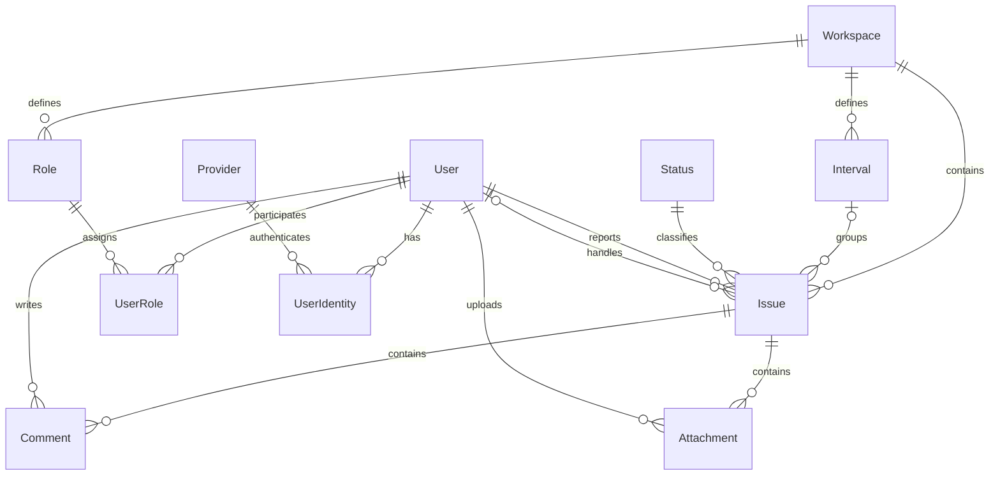

This entity relationship diagram (ERD) defines the issue tracker’s relationships. Minimum fields are documented in the table pages; physical database implementation details remain to be defined.

[Open the full-size diagram](/diagrams/issue-tracker-erd.svg).

## Relationships

- UserIdentity links one User to one Provider, with composite primary key (user_id, provider_id). Each user has at most one identity per provider.
- provider_id and provider_subject are unique together; an external account cannot belong to multiple users. User email is required, unique, and verified.
- Each issue belongs to one workspace and has one status and one reporter.
- Each issue may have one assignee and one planning interval. Its interval must belong to the same workspace.
- Each interval belongs to one workspace and can group multiple issues.
- Each comment belongs to one issue and has one User as its author.
- Each attachment belongs to one issue and has one User as its uploader.
- Users and the fixed statuses are shared globally.
- Each Role belongs to exactly one Workspace. A workspace defines its own roles.
- UserRole connects exactly one User to exactly one Role. The workspace comes through the Role, with no direct Workspace–UserRole relationship.
- A user joins a workspace through a role assignment and can have only one role per workspace. Users no longer have access to every workspace by default.
- Each role specifies its permitted [status transitions](/core/api/status-transitions/) within its workspace.
- Issue descriptions and comments can mention attachment filenames as ordinary text. There is no dedicated reference field or comment-to-attachment relationship.

In the diagram, **1** means exactly one, **0..1** means optional and at most one, and **0..*** means zero or more. Labels beside an entity state how many instances can relate to one instance at the other end.

## Mermaid source

See [Tables](/core/api/schema/) for each entity’s purpose and relationships.
