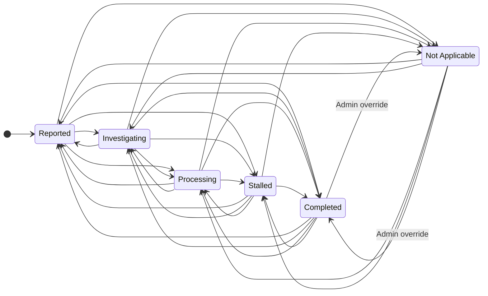
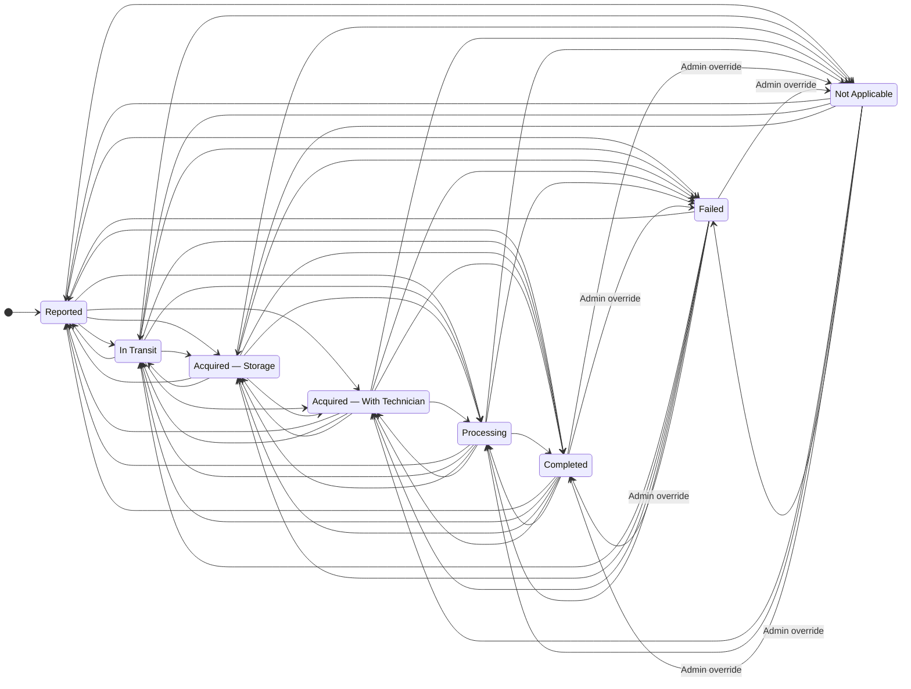

These examples are deliberately unstructured for review. Each workspace owns its statuses and roles. Specific permissions for Reporter, Agent, Support, Supervisor, and Technician remain to be defined; an arrow shows a possible move, not a grant to every role.

## Shared rules

- Every new issue starts in its workspace’s **Reported** status, including issues created by Admin. Creation is not a configurable transition.
- A role-permitted move may go between any unfinished statuses or from unfinished to closed. Each direction requires its own permission from the user’s role in the issue’s workspace.
- Closed issues may reopen into any unfinished status.
- **Admin may set an existing issue to any status in the same workspace**, including another closed status. Admin cannot bypass the initial-status rule, workspace boundary, or Resolution requirement.
- In repair, **In Transit and Acquired — Storage are skippable**. The examples do not enforce a sequence; structured flows will be refined after review.

## Resolution on closure

`resolution` is optional plain text while an issue is unfinished. Any move into a closed status requires a resolution containing non-whitespace text, including Admin overrides and moves between closed statuses.

A transition may supply the resolution and destination status together. Validate the resulting issue and save both atomically: if closure is rejected, neither field changes. An existing nonblank resolution satisfies the requirement. A closed issue cannot have its resolution cleared.

On reopening, retain the resolution. It may subsequently be edited or cleared while the issue is unfinished. An initial issue response includes `resolution: null` when none was supplied. See [Issue](/core/api/schema/issue/) for its fields and display response.

## Incident Report

**Roles:** Reporter, Agent, Support, Supervisor, Admin.

[Open the full-size diagram](/diagrams/status-transitions.svg).

| Category   | Statuses                                     |
| ---------- | -------------------------------------------- |
| Unfinished | Reported, Investigating, Processing, Stalled |
| Closed     | Completed, Not Applicable                    |

### Mermaid source

The source lists each directed move. Unlabelled moves require role permission; moves between closed statuses are labelled Admin override. All moves into closed statuses require nonblank resolution.

## Haunted Machine Repair

**Roles:** Reporter, Technician, Admin.

[Open the full-size diagram](/diagrams/repair-status-transitions.svg).

| Category   | Statuses                                                                         |
| ---------- | -------------------------------------------------------------------------------- |
| Unfinished | Reported, In Transit, Acquired — Storage, Acquired — With Technician, Processing |
| Closed     | Completed, Failed, Not Applicable                                                |

**Acquired — Storage** means the machine has been received and is waiting in storage. **Acquired — With Technician** means the technician has physical custody but repair has not started. **Processing** means repair is underway. **Failed** means the repair attempt ended unsuccessfully.

### Mermaid source

The source lists each directed move. Unlabelled moves require role permission; moves between closed statuses are labelled Admin override. All moves into closed statuses require nonblank resolution.

## Acceptance criteria

| Scenario                                                                                     | Expected behavior                                                                       |
| -------------------------------------------------------------------------------------------- | --------------------------------------------------------------------------------------- |
| Create an issue, including as Admin                                                          | Status is Reported in the issue’s workspace; omitted resolution is null.                |
| Select a status from another workspace                                                       | Reject, including for Admin.                                                            |
| Close with missing, empty, or whitespace-only resolution and no existing nonblank resolution | Reject; neither status nor resolution changes.                                          |
| Close with a supplied nonblank resolution                                                    | Save destination status and resolution together.                                        |
| Close with an existing nonblank resolution                                                   | Accept if the role permits the move.                                                    |
| Admin moves into or between closed statuses                                                  | Require nonblank resolution; the override does not waive validation.                    |
| Clear resolution while the issue remains closed                                              | Reject, including for Admin.                                                            |
| Reopen a closed issue                                                                        | Retain resolution; permit a later edit or clear while unfinished.                       |
| Skip In Transit or Storage during repair                                                     | Allow when the role permits the exact move.                                             |
| Non-Admin attempts a move between closed statuses                                            | Reject in these examples.                                                               |
| Admin selects any destination in the same workspace for an existing issue                    | Allow subject to the Resolution rule; selecting the current status leaves it unchanged. |

These are documentation acceptance criteria, not implemented backend tests. Permission-storage fields, individual non-Admin role permissions, and API implementation remain to be defined. See the [ERD](/core/api/datadiagram/) for entity relationships.
