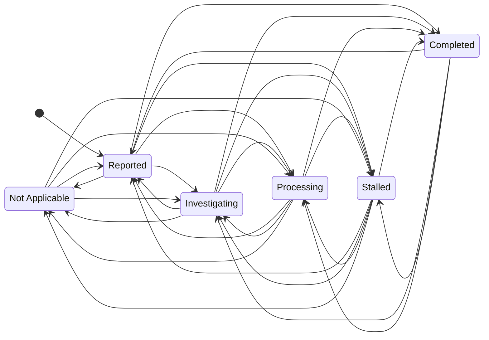

Each workspace’s roles specify which individual status transitions they permit. A user joins a workspace through a UserRole assignment to one of its roles, with one role per user per workspace.

[Open the full-size diagram](/diagrams/status-transitions.svg).

**Every status-to-status direction requires explicit permission from the user’s role in the issue’s workspace.** Permission for one transition does not imply permission for its reverse or any other transition. A role in another workspace grants no permission here.

## Initial status

Every new issue starts in **Reported**. No role can create an issue in another status. The entry arrow represents creation, not a configurable status transition. Role-controlled transitions apply only after creation; reopening changes an existing issue and follows the transition rules below.

## Allowed directions

| From           | Possible destinations, subject to role permission              |
| -------------- | -------------------------------------------------------------- |
| Reported       | Investigating, Processing, Stalled, Completed, Not Applicable  |
| Investigating  | Reported, Processing, Stalled, Completed, Not Applicable       |
| Processing     | Reported, Investigating, Stalled, Completed, Not Applicable    |
| Stalled        | Reported, Investigating, Processing, Completed, Not Applicable |
| Completed      | Reported, Investigating, Processing, Stalled                   |
| Not Applicable | Reported, Investigating, Processing, Stalled                   |

Reported, Investigating, Processing, and Stalled are unfinished statuses. An unfinished issue may move to any other unfinished status, Completed, or Not Applicable when its role permits that exact transition. This includes forward skips and backward moves.

Stalled means progress is blocked or paused. Any unfinished issue can become Stalled, and a Stalled issue may move to any other status when permitted; it does not have to return to its previous status.

Completed and Not Applicable are closed outcomes, but they are not terminal: either can reopen into any unfinished status, including Stalled, with explicit role permission. There is no direct transition between Completed and Not Applicable.

The diagram’s grouped arrows apply to every unfinished status. Each two-headed arrow represents two separately controlled directions. The table and Mermaid source enumerate all 28 possible status-to-status transitions, plus the creation entry into Reported; a role may permit only a subset.

## Mermaid source

## Boundaries

Role names, permission-storage fields, and API implementation remain to be defined. This diagram describes workflow rules; entity relationships are documented in the [ERD](/core/api/datadiagram/). See [Role](/core/api/schema/role/) and [Status](/core/api/schema/status/) for their entity descriptions.
