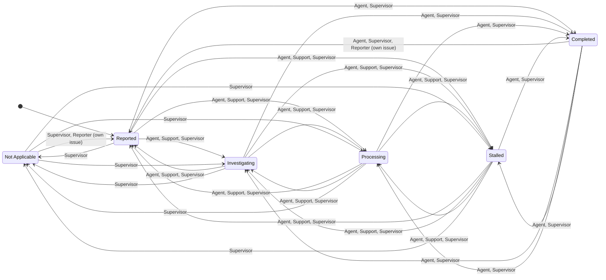

**Roles:** Reporter, Agent, Support, Supervisor, Admin. **Support means Agent Support**, including scouting, spotting, equipment, and inventory assistance. It is not a customer-support or triage role.

The [shared rules](/core/status/) require Reported at creation, workspace-scoped permissions, and nonblank Resolution for every closed destination.

[Open the full-size diagram](/diagrams/status-transitions.svg).

## Allowed transitions

Unfinished statuses are **Reported, Investigating, Processing, and Stalled**. Closed statuses are **Completed and Not Applicable**.

| Role                       | From                      | To                           |
| -------------------------- | ------------------------- | ---------------------------- |
| Reporter                   | Completed, Not Applicable | Reported (own issues only)   |
| Agent, Support, Supervisor | Any unfinished status     | Any other unfinished status  |
| Agent, Supervisor          | Any unfinished status     | Completed                    |
| Supervisor                 | Any unfinished status     | Not Applicable               |
| Agent, Supervisor          | Completed                 | Any unfinished status        |
| Supervisor                 | Not Applicable            | Any unfinished status        |
| Admin                      | Any existing status       | Any status in this workspace |

Agent, Support, and Supervisor may skip stages and move backward among unfinished statuses. Staff permissions apply across the workspace. Support cannot close or reopen an issue. Agent cannot mark an issue Not Applicable or reopen Not Applicable. Reporter may only reopen their own closed issues to Reported; they cannot make other status changes. Only Admin can move directly between closed statuses.

## Mermaid source

Admin may set any existing issue status in the workspace; its extra arrows are omitted for readability. Admin cannot bypass the Resolution requirement or create an issue outside Reported.

## Acceptance criteria

- Support can skip Reported → Processing and move Processing → Investigating, but cannot close or reopen.
- Agent can close an unfinished issue as Completed and reopen Completed into an unfinished status, but cannot close as Not Applicable or reopen that outcome.
- Supervisor can close either way and reopen either outcome into any unfinished status.
- Reporter can reopen their own Completed or Not Applicable issue to Reported only. Reject attempts on another reporter’s issue or to another destination.
- Non-Admin moves directly between closed statuses are rejected.
- All roles follow the shared workspace and Resolution rules.
