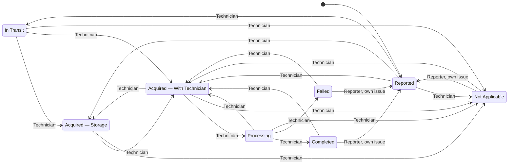

**Roles:** Reporter, Technician, Admin. The [shared rules](/core/status/) require Reported at creation, workspace-scoped permission, and nonblank Resolution for every closed destination.

[Open the full-size diagram](/diagrams/repair-status-transitions.svg).

## Allowed transitions

| Role       | From                              | To                                                                         |
| ---------- | --------------------------------- | -------------------------------------------------------------------------- |
| Reporter   | Completed, Failed, Not Applicable | Reported, only for an issue they reported                                  |
| Technician | Reported                          | In Transit, Acquired — Storage, Acquired — With Technician, Not Applicable |
| Technician | In Transit                        | Acquired — Storage, Acquired — With Technician, Not Applicable             |
| Technician | Acquired — Storage                | Acquired — With Technician, Not Applicable                                 |
| Technician | Acquired — With Technician        | Acquired — Storage, Processing, Not Applicable                             |
| Technician | Processing                        | Acquired — With Technician, Completed, Failed, Not Applicable              |
| Technician | Completed, Failed, Not Applicable | Acquired — With Technician                                                 |
| Admin      | Any existing status               | Any status in this workspace                                               |

In Transit and Storage are optional. With Technician means physical custody before repair begins; Processing means repair is underway. Failed means the repair attempt ended unsuccessfully. Technician cannot skip With Technician or Processing to reach Completed or Failed. Staff permissions apply across the workspace, while Reporter reopening is restricted to their own issues.

## Mermaid source

Admin can override to any status for an existing issue; these extra arrows are omitted for readability. Admin must still supply or retain a nonblank Resolution on closure. Reopening retains Resolution.

## Acceptance criteria

- Technician may skip In Transit and Storage by moving Reported directly to With Technician.
- Technician cannot move Reported, In Transit, or Storage directly to Processing, Completed, or Failed.
- Technician can move Storage ↔ With Technician and Processing → With Technician.
- Only Processing may move to Completed or Failed under Technician permissions.
- Technician can close any unfinished issue as Not Applicable, and can reopen any closed outcome to With Technician.
- Reporter can reopen only their own closed issues to Reported, not to With Technician or another status.
- All closed destinations require nonblank Resolution, including Admin overrides.
